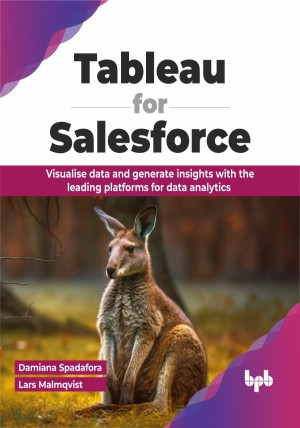

# Tableau for Salesforce

Connect, analyze, decide: Seamless integration of Tableau and Salesforce

This is the repository for [Tableau for Salesforce
](https://bpbonline.com/products/tableau-for-salesforce?variant=43379865288904),published by BPB Publications.

## About the Book
Tableau is a powerful data visualization tool, and Salesforce CRM is the most successful customer relationship management software. Companies often use these two tools to analyze data and create visualizations.
 
The book starts with an introduction to both Tableau and Salesforce CRM. It then goes on to show how you can connect Tableau with Salesforce CRM and link the two tools. Then, it walks through some of the key features of this connection that allow for seamless data analysis and visualization. It then moves on to advanced use cases, combining Salesforce and Tableau for advanced analytics and decision-making.

After reading this book, the reader will have the knowledge to start using both tools to analyze real-world CRM data and create CRM analytical dashboards that generate value for their companies.

## What You Will Learn
• Successfully connect Tableau with Salesforce CRM, and overcome common challenges faced during integration.

• Effectively use Tableau and Salesforce together to analyze data and create dynamic visualizations that are actionable and insightful.

• Combine the power of Salesforce and Tableau to create more complex analyses, aiding in strategic decision-making.

• Design and implement CRM-specific dashboards using Tableau, catering to the unique needs of CRM data analytics.

• Translate analytical findings into tangible business strategies and actions, thereby driving value and growth for your company. 

